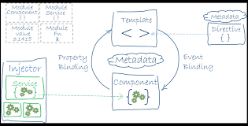

# Einheit 13: 18.01.2018

## Wiederholung
javascript, typescript, cookies etc. // TODO

Angular:
* Client-Web Application
* Google
* Angular cli
    * ng serve
    * ng new
* besteht aus Komponenten



## Neues Projekt
Mit `ng new ue09` erstellten wir ein neues Angular Projekt.

Hierbei gilt es zu beachten, dass man sich im richtigen Pfad befindet. Falls dies nicht der Fall ist kann man mit `cd [pfad]` zum richtigen Pfad wechseln oder mit `mkdir [pfad]`einen neuen Pfad erstellen.

## Neue Komponente: Uhr
In diesem Projekt wollen wir die Uhr aus ue08 als neue Komponente anlegen um sie überall nutzen zu können.
Hierzu erstellten wir die neue Datei `app-clock.component.ts`.
Außerdem mussten wir die Komponente in der `app.module.ts` einbinden.
Dies geschieht hier in den Zeile 6 und 11.

```js
import { BrowserModule } from '@angular/platform-browser';
import { NgModule } from '@angular/core';

import { UserService} from './user.service';
import { AppComponent } from './app.component';
import { AppClockComponent} from './app-clock.component';
import { AppUserTableComponent} from './app-user-table.component';

@NgModule({
  declarations: [
    AppComponent, AppClockComponent, AppUserTableComponent
  ],
  imports: [
    BrowserModule
  ],
  providers: [UserService],
  bootstrap: [AppComponent]
})
export class AppModule { }
```

In der Datei `app-clock.component.ts` muss nun wieder die Uhr umgesetzt werden. 
```js
import { Component, OnInit, OnDestroy } from '@angular/core';

@Component({
  selector: 'app-clock',
  template: `<p>{{time}}</p>`
})
export class AppClockComponent implements OnInit, OnDestroy {
  public time: string;
  private _timer;

  constructor () {
  }

  public ngOnInit () {
    console.log('AppClockComponent: ngOnInit');
    this.updateTime();
    this._timer = setInterval( () => this.updateTime(), 100 );
  }

  public ngOnDestroy () {
    if (this._timer !== undefined) {
      clearInterval(this._timer);
      this._timer = undefined;
    }
  }

  private updateTime() {
    const now = new Date();
    this.time = now.toLocaleTimeString();
    }
}
```

Diese Komponente kann nun beliebig oft verwendet werden, muss nur das ` <app-clock>` tag verwendet werden.

// TODO

implementiernug onClick um eine Konsolenausgabe zu erstellen wenn auf die Uhr geklickt wird
verändern des Mauszeigers wenn auf Uhr

bootstrap einbinden:  
* npm install --save  @ng-bootstrap/ng-bootstrap
* npm install --save  bootstrap@4.0.0-alpha.6

import bootstrap table
https://getbootstrap.com/docs/4.0/content/tables/

table füllen etc.

neue Komponente für table

service für datenaustausch zwischen den Komponenten